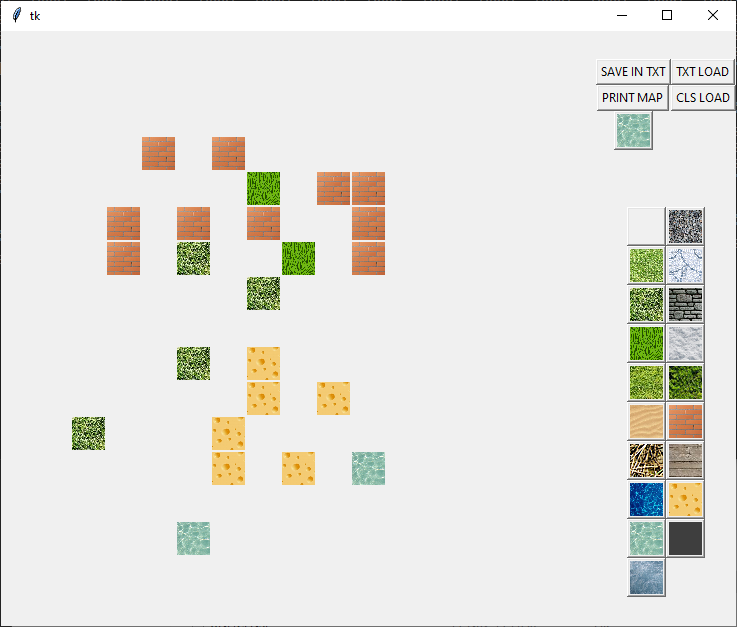

# A simple walking game

## Description

Just a simple tkinter python game where you can walk in four dimensions using arrow buttons and enter button to
interact with objects.

## Features

 - A 3x3 chunks of 17x17 squares area to explore plus 2 chunks of sewage system
 - Some squares can't be walked on
 - You can use ladders to travel to underground location
 - Two interactable npcs - fire ifrits

## Screenshots

## Map editor

Also a simple WYSIWYG map editor was made.

